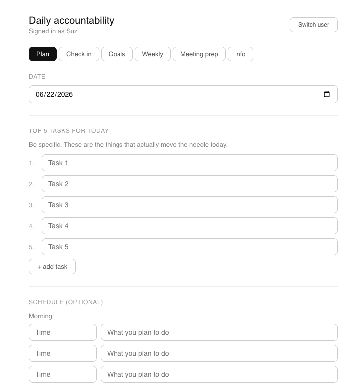
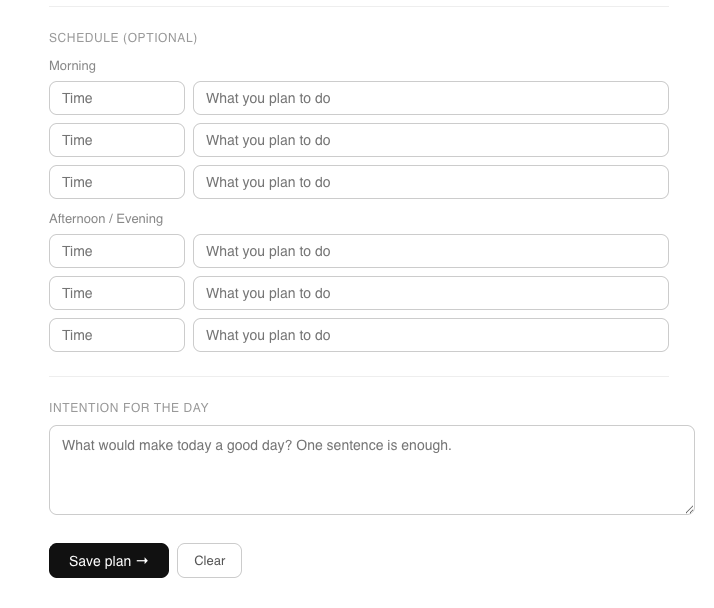
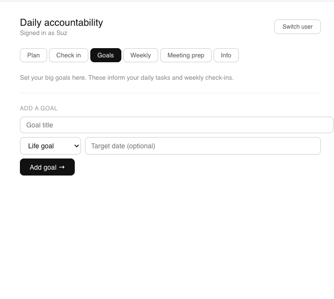

# Daily Accountability Tracker

A small React app for two people to plan their day, check in on progress, and hold each other accountable on shared goals. Deployed privately and protected behind a shared password.

---

## What it does

**Plan** — Each day, set your top 5 tasks, a rough schedule, and one intention for the day.

**Check in** — That night or next morning, mark each task Done / Partial / Skipped, add what happened, and get a direct read from Claude on how the day went.

**Goals** — Set big life goals and project goals with target dates. These inform your daily check-ins and weekly reflections.

**Weekly** — Once a week, answer three questions about what moved, what stalled, and what you're committing to next week. If both people submit, Claude reads them together and gives a joint reflection.

**Meeting prep** — Before weekly meetings, fill in what you want to cover, where you're stuck, and what you need from the other person. Claude builds you an agenda.

**Google Sheets logging** — Every check-in, weekly reflection, and meeting prep automatically logs to a shared Google Sheet so both people can see the full history.

---

## Data

- Plans, goals, and check-ins are stored in the browser (`localStorage`) per user, per day.
- Submissions also log to a shared Google Sheet for a persistent history.
- Access is gated behind a shared password; API keys and the Sheets endpoint are kept server-side, not in client code.

---

## Screenshots

**Plan** — set your top 5 tasks for the day:

Schedule and daily intention:

**Goals** — set life goals and project goals with target dates:

---

## Files

| File | What it is |
|------|-----------|
| `src/App.js` | The full React app |
| `api/` | Serverless functions (login, Claude proxy, Sheets proxy) |
| `accountability-sheets.gs` | Google Apps Script for Sheets logging |
